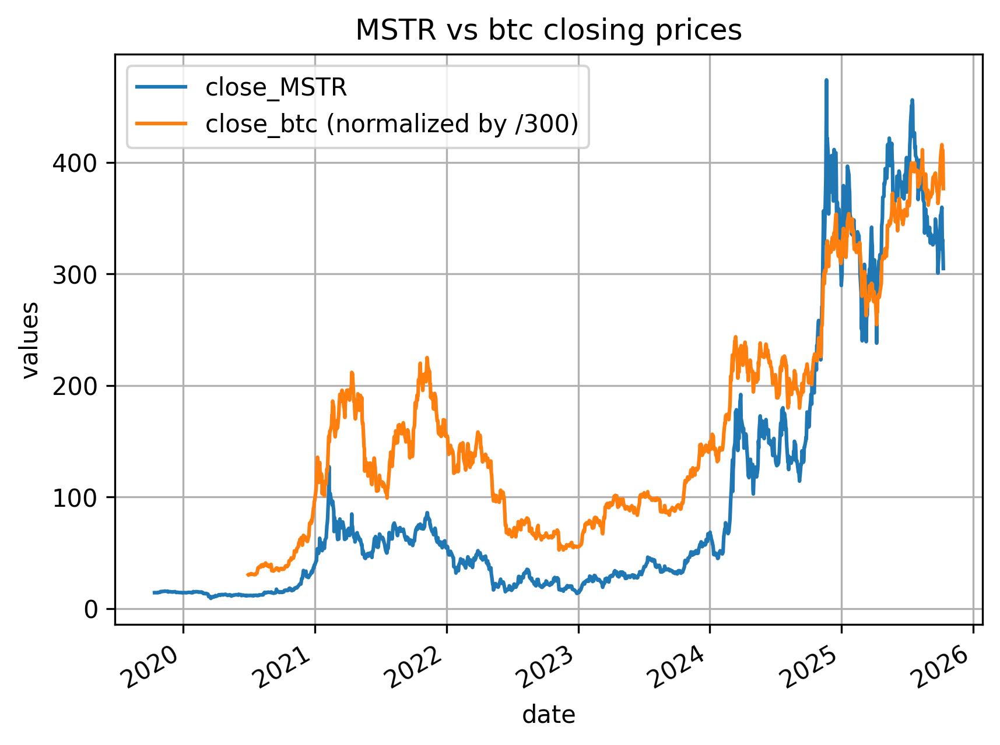
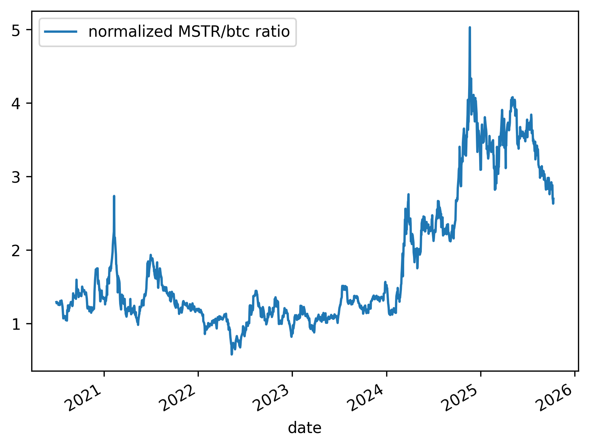
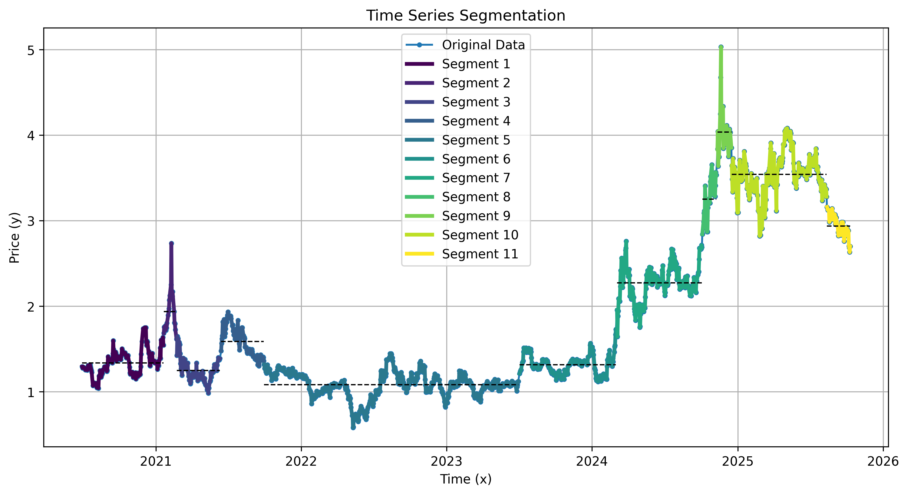
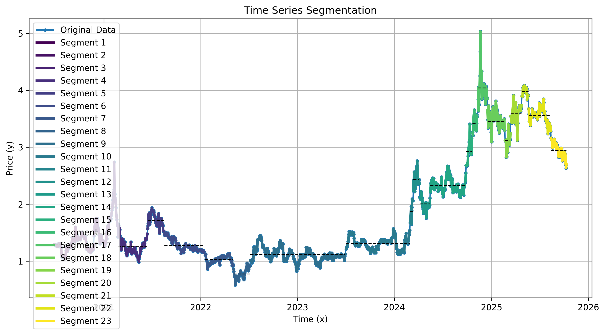
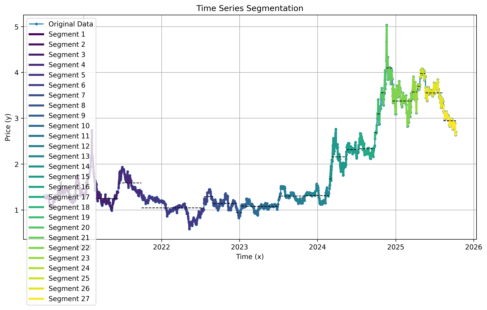

# Crypto-Backed Stock Valuation Analyzer
## Overview
This project analyzes and aims to predict the price of asset-backed stocks by examining the relationship between 
companies with significant Bitcoin holdings (e.g., MSTR, MARA) and the price of Bitcoin itself.

The core hypothesis is that the stock price of such companies is composed of two main factors: 
**the value of their underlying business operations and the market value of their Bitcoin reserves.** 
By isolating and factoring out the value of the Bitcoin assets, we can derive a metric for the 
company's "premium" or "discount." This metric presumably reflects **the market's sentiment and 
valuation of the core business**, independent of its crypto holdings.

To achieve this, the first step is to "factor out" the company's crypto holdings. 
Due to the lack of a consistent data source for fundamental data like crypto holdings, debts, 
and outstanding shares, this project currently applies a simplified model which uses the quotient 
of the stock price and the crypto price. A more complex model is planned for future study.

## How it works
1. Data Fetching
    * Crypto Price: 5 years of daily historical Bitcoin price data has been downloaded from [coincodex](https://coincodex.com/crypto/bitcoin/historical-data/)
   for offline analysis. Fetching live data is a planned next step.
    * Stock Price: Daily stock price data is fetched from Interactive Brokers (IBKR).
2. Analysis 
    * As discussed above, the model computes the "premium" or "discount" by taking the quotient of the stock price and the crypto price.
    * This resulting ratio is then used to help determine the stock's fair value at a specific point in time.

### Key Features
* Correlation Analysis: Directly compares the price movements of asset-backed stocks and Bitcoin.
* Premium/Discount Plotting: Visualizes the calculated "true" value of the company over time.
* Configurable: Easily change the target stock ticker and data sources.
* Extensible: The framework can be adapted to analyze other asset-backed securities.

## Preliminary result
1. **Price Correlation**: The chart below shows a strong visual correlation between the price of Bitcoin and MSTR.
    
2. **Valuation Ratio**: To factor out the impact of the Bitcoin price, we compute the quotient of the two prices and normalize the result.
    
3. **Mean Reversion**: This ratio can be seen as the fluctuation caused by market sentiment around the company's core business valuation. 
    Based on the Mean Reversion Theory, we assume the business valuation is stable over a specific period and attempt to find this value 
    by plotting the average line.
    
4. **Segmentation Algorithm**: Finding the mean line depends on how the time series is segmented. 
    This project implements a canonical segmentation algorithm where a "cost" is associated with creating a new segment. 
    A high cost results in fewer segments with higher variance, while a low cost creates more segments with lower variance. 
    The initial implementation can be found in src/bitfund/utils/segmentation.py. Below is another segmentation result 
    with more segments compared to the one above.
    
5. **Real-Time Segmentation**: The initial algorithm processes a static dataset. To make this useful for trading signals, a "running" version of the algorithm was developed
     (src/bitfund/utils/segmentation_r2.py) that can update the segmentation as new data points arrive. So I've created a running
    version of the algorithm (see src/bitfund/utils/segmentation_r2.py). See the segmentation result of this running algorithm below:
    

## Next Step
1. **Backtesting & Simulation**
   1. Verify that backtest module works as expected.
   2. Run simulations to evaluate the model's performance and tune parameters (e.g., segmentation cost, strategy rules) to find the optimal configuration.

## Reference
### Notes to use IB TWS api
1. Download & Install java runtime: https://www.java.com/en/download/
2. Download & Run IB TWS: https://www.interactivebrokers.com/campus/ibkr-api-page/twsapi-doc/#api-introduction
3. Sign in with paper account.

### Python Setup
1. create python environment: conda create -n trade python=3.11 (once)
2. conda activate trade (everytime)
3. 'poetry install' after git clone
4. 'poetry add xx' to add a lib
5. 'poetry install' to update the installed env
5. python src/test.py

### Jupyter
1. 'poetry install' to install jupyterlab
2. In the repo src/jupyter/ run 'jupyter-lab'
3. Open the address in a browser
